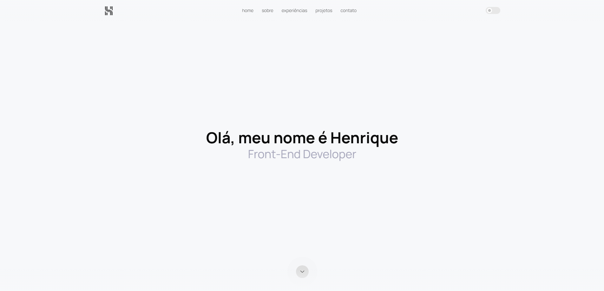

# 🌐 Portfólio: Henrique Papile

## 📌 Descrição do Projeto

Bem-vindo ao meu portfólio de desenvolvedor front-end! Este projeto foi criado para apresentar minhas habilidades, projetos e experiências na área de desenvolvimento web. Este portfólio foi desenvolvido com foco em performance, acessibilidade e design responsivo. Ele apresenta informações sobre mim, minhas stacks favoritas, projetos desenvolvidos e formas de contato.

## 🔥 Funcionalidades

<ul>
  <li>Página inicial com introdução animada</li>
  <li>Sessão “Sobre mim” com informações e habilidades</li>
  <li>Sessão “Experiências” com informações sobre minhas experiências profissionais</li>
  <li>Sessão “Projetos” com lista de projetos com preview e links para os sites</li>
  <li>Sessão “Contato” com formulário de contato funcional</li>
</ul>

## 🛠️ Tecnologias Utilizadas:

<ul>
  <li>React</li>
  <li>Tailwind CSS</li>
  <li>JavaScript (ES6+)</li>
  <li>Framer Motion</li>
  <li>EmailJS</li>
</ul>

 
Deploy: <a href="https://henriquepapiledev.github.io" target="_blank">Clique aqui</a> 
